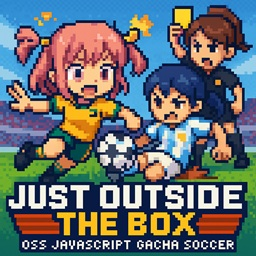

# ⚽ Just Outside the Box: Gacha Soccer



**Just Outside the Box** is a pixel-style browser/desktop gacha soccer simulator. Pull from randomized packs of historic and legendary international football teams, build your collection, and take your squad through an intense 11-match season and knockout tournament!

---

## 🎮 Features

- 🃏 Gacha-based team pulls
- 🪙 Coin-based pull system with bonus rewards
- 🏆 Career Mode: 11-match season + 2 Tournaments
- 📊 Unique team stats, abilities, and rarities (C, R, SR, SSR)
- 🔄 Persistent local progress via `localStorage`
- ⚽ Penalty shootouts, yellow cards, and simulated commentary

---

## 📦 Builds

This app is powered by **Tauri** and supports:
- ✅ **Linux** `.deb` builds
- ✅ **Windows** `.exe` builds

Prebuilt binaries are available under the [Releases](https://github.com/MARKMENTAL/just-outside-the-box/releases) tab.

---

## 🛠️ Build Instructions

To build manually:

### Linux (Debian 12+ recommended)

```bash
# Install required system packages
sudo apt install libwebkit2gtk-4.1-dev build-essential curl wget file libxdo-dev libssl-dev libayatana-appindicator3-dev librsvg2-dev patchelf xdg-utils

# Install project dependencies
npm install

# Build Tauri app for Linux
npm run tauri build
````

### Windows (Cross-compiling from Linux)

```bash
# Add Rust Windows target
rustup target add x86_64-pc-windows-gnu

# Then run:
npm run tauri build -- --target x86_64-pc-windows-gnu
```

Or use the provided helper script:

```bash
./start-build.sh
```

---

## 💾 Save System

Your card inventory and coin balance are stored in the browser (or Tauri) via `localStorage`. Click "Clear Saved Data" to reset your session.

---

## 🌐 Run in Browser (Development Mode)

```bash
npm run tauri dev
```

Or simply open `index.html` in a modern browser for a web preview (some features like saving may vary).

---

## 👨‍💻 Contributing

This is a for-fun project combining:

* ⚽ Football fandom
* 🎴 Gacha mechanics
* 🧃 Cozy UI nostalgia

Feel free to fork, contribute, or submit your own teams!

---

## 📄 License

MIT — do whatever you want, just don’t remove the flair.

---

*“Right outside the penalty box… there’s only one way this ends.”*


